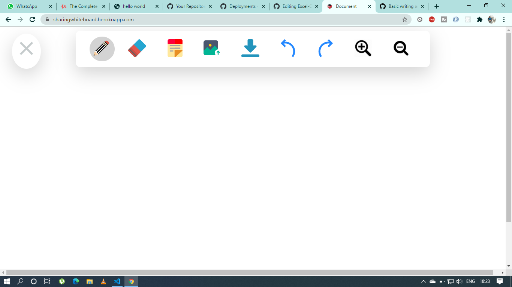

# Final Year Project

## Discription :small_red_triangle_down: :-
panademic Openboard
Added Functionalities using Canvas & JavaScript library.
This project will solve problems faced while keeping social distance in pandaemic situation.
The idea here is to teach students through whiteboard but in virtual platform.
 
 
 
 ## Technologies :rocket::-
Project is created with:
* Node.js :heavy_check_mark:
* JavaScript :heavy_check_mark:
* Jquery :heavy_check_mark:
* DOM :heavy_check_mark:
* Canvas Tag of HTML :heavy_check_mark:
* HTML/CSS :heavy_check_mark:

## UI Image of the project :-

  
## Deploy Uing Heroku :-
[Click Link](https://sharingwhiteboard.herokuapp.com/)

